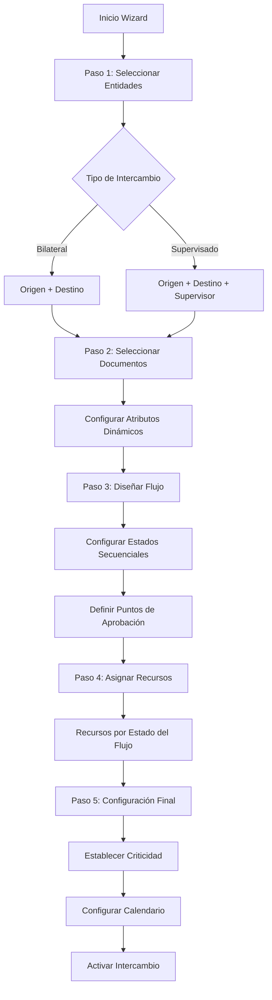
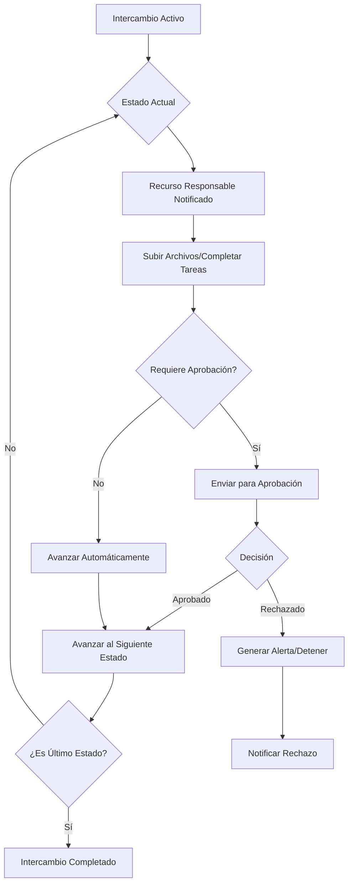

# 📋 DESCRIPCIÓN FUNCIONAL COMPLETA - AXIOMA DOCS

## 🎯 PROPÓSITO DEL SISTEMA

**AxiomaDocs** es un sistema integral de gestión documental y control de intercambios documentales diseñado para organizaciones que necesitan administrar documentación de recursos (personas, bienes, proveedores) y coordinar flujos de intercambio de documentos entre múltiples entidades con seguimiento de vencimientos, estados y cumplimiento normativo.

---

## 🏗️ ARQUITECTURA DUAL DEL SISTEMA

### **MÓDULO 1: GESTIÓN INDIVIDUAL DE DOCUMENTOS**
Sistema tradicional de administración documental con seguimiento de vencimientos y estados.

### **MÓDULO 2: INTERCAMBIOS DOCUMENTALES**
Sistema avanzado de flujos coordinados entre entidades con calendarios, aprobaciones y seguimiento automático.

---

## 👥 TIPOS DE USUARIOS

### **🔐 Administradores**
- Acceso completo a ambos módulos
- Gestión de usuarios y permisos
- Configuración de maestros (Estados, Documentos, Entidades)
- Supervisión de todos los intercambios

### **👤 Usuarios Estándar**
- Acceso según permisos asignados por entidad
- Pueden crear/gestionar intercambios de sus entidades asignadas
- Visualización limitada a intercambios donde participan
- Notificaciones de tareas pendientes

---

## 📊 MÓDULO 1: GESTIÓN INDIVIDUAL

### **🎛️ Dashboard Individual**
- **Estadísticas en tiempo real**: Documentos vigentes, vencidos, por vencer
- **Alertas automáticas**: Próximos vencimientos configurables
- **KPIs visuales**: Estados críticos, recursos sin documentación
- **Auto-refresh**: Actualización cada 30 segundos

### **📋 Gestión de Estados**
- **CRUD completo**: Crear, editar, eliminar estados personalizados
- **Estados predeterminados**: En Trámite, Vigente, Por Vencer, Vencido
- **Sistema de niveles**: Criticidad del 1-10 para priorización
- **Código de colores**: Identificación visual inmediata

### **📄 Maestro de Documentos**
- **Tipos de documento**: Catálogo centralizado reutilizable
- **Configuración**: Código, descripción, días de vigencia, días de anticipación
- **Documentos universales**: Con fechas completas (solo lectura en asignaciones)
- **Documentos específicos**: Fechas editables por asignación
- **Atributos dinámicos**: Campos personalizables (texto, fecha, numérico)
- **Marcadores**: Obligatorio, Universal para comportamientos especiales

### **👤 Gestión de Recursos**
- **CRUD de personas/bienes**: Datos personales, estado activo/inactivo
- **Asignación de documentos**: Vinculación con seguimiento de fechas
- **Estados críticos**: Detección automática de situaciones urgentes
- **Histórico**: Trazabilidad de cambios y modificaciones

### **🏢 Gestión de Entidades**
- **Organizaciones**: Empresas, proveedores, clientes, instituciones
- **Configuración**: Datos de contacto, plataforma web, configuraciones
- **Documentos requeridos**: Especificación de documentación obligatoria
- **Asignación de recursos**: Vinculación temporal con fechas de vigencia

### **📊 Reportes Individuales**
1. **Documentación por Estado**: Agrupación de recursos por estado de documentos
2. **Recursos por Entidad**: Vista organizacional con estadísticas
3. **Documentos Próximos a Vencer**: Alertas con filtros de anticipación
- **Exportación**: Excel y PDF con formateo profesional

---

## 🔄 MÓDULO 2: INTERCAMBIOS DOCUMENTALES

### **🎛️ Dashboard de Intercambios**
- **Intercambios activos**: Estado en tiempo real de procesos en curso
- **Pendientes de aprobación**: Cola de tareas por usuario
- **Vencimientos críticos**: Alertas por criticidad y proximidad
- **Estadísticas de cumplimiento**: Métricas de eficiencia

### **🎯 Creación de Intercambios (Wizard 5 Pasos)**

#### **Paso 1: Configuración de Entidades**
- **Tipo de intercambio**:
  - **Bilateral**: Entre 2 entidades directamente
  - **Supervisado**: Entidad supervisora monitorea intercambio entre otras 2
- **Roles**: Entidad Origen, Entidad Destino, Entidad Supervisora (opcional)

#### **Paso 2: Selección de Documentos**
- **Catálogo disponible**: Documentos del maestro unificado
- **Configuración de atributos**: Valores para campos dinámicos por documento
- **Marcación obligatoria**: Documentos críticos para el intercambio

#### **Paso 3: Diseño de Flujo**
- **Estados secuenciales**: Configuración del flujo de trabajo
- **Duración por estado**: Días estimados para cada etapa
- **Puntos de aprobación**: Estados que requieren aprobación explícita
- **Flujos reutilizables**: Plantillas para intercambios recurrentes

#### **Paso 4: Asignación de Recursos**
- **Recursos por estado**: Responsables específicos para cada etapa
- **Roles múltiples**: Un recurso puede tener diferentes roles por etapa
- **Notificaciones**: Configuración de alertas por recurso

#### **Paso 5: Configuración Final**
- **Criticidad del intercambio**: Baja, Media, Alta, Crítica
- **Calendario inicial**: Fechas estimadas de inicio y fin
- **Activación**: Puesta en marcha del intercambio

### **⚙️ Operación de Intercambios**

#### **🔄 Gestión de Estados**
- **Avance secuencial**: Progresión automática al completar condiciones
- **Aprobaciones/Rechazos**: 
  - **Aprobado**: Continúa al siguiente estado
  - **Rechazado**: Detiene flujo y genera alertas
- **Observaciones**: Comentarios y justificaciones por estado

#### **📎 Gestión de Archivos**
- **Archivos por estado**: Documentos específicos para cada etapa
- **Versionado**: Histórico de subidas y modificaciones
- **Tipos permitidos**: Configuración de formatos aceptados
- **Límites de tamaño**: Control de capacidad de almacenamiento

#### **📅 Calendario y Cronograma**
- **Vista temporal**: Cronograma visual de todos los estados
- **Filtros avanzados**: Por entidad, recurso, documento, criticidad
- **Ajustes manuales**: Reprogramación de fechas por retrasos
- **Alertas automáticas**: Notificaciones antes, durante y después de vencimientos

### **🔔 Sistema de Notificaciones**
- **Canales múltiples**: Email y WhatsApp (futuro)
- **Eventos configurables**:
  - Cambio de estado en intercambio
  - Proximidad de vencimiento
  - Rechazo de aprobación
  - Asignación de nueva tarea
- **Personalización**: Templates de mensajes por tipo de evento

### **📊 Reportes de Intercambios**
1. **Estado General de Intercambios**: Vista consolidada de todos los procesos
2. **Cronogramas y Cumplimiento**: Análisis de eficiencia temporal
3. **Documentos por Intercambio**: Detalle de documentación por proceso
4. **Recursos en Intercambios**: Carga de trabajo y asignaciones
- **Filtros avanzados**: Por estado, criticidad, entidad, fecha
- **Exportación**: Excel y PDF con gráficos y estadísticas

---

## 🔐 SISTEMA DE PERMISOS

### **👑 Administradores**
- Gestión completa de usuarios y asignación de permisos
- Acceso a todos los intercambios y configuraciones
- Configuración de maestros y parámetros del sistema

### **👤 Usuarios por Entidad**
- **Permisos granulares**:
  - Visualización: Solo intercambios de entidades asignadas
  - Creación: Según permisos específicos otorgados
  - Aprobación: Según rol asignado en flujos específicos
- **Autogestión**: Cambio de contraseña y configuración personal

---

## 💾 ARQUITECTURA TÉCNICA

### **🗄️ Base de Datos**
- **PostgreSQL 14+** (Migración desde MySQL aprobada - Ver POSTGRESQL-MIGRATION.md)
- **Características clave**: JSONB nativo para atributos dinámicos, CTEs recursivos para flujos, LISTEN/NOTIFY para notificaciones real-time
- **Modelos principales**: Usuario, Estado, Recurso, Documentacion, Entidad
- **Modelos de intercambio**: Intercambio, IntercambioFlow, IntercambioDocumento, IntercambioRecurso, CalendarioIntercambio
- **Gestión de archivos**: IntercambioArchivos con versionado y metadatos JSONB
- **Permisos**: UsuarioEntidad para control granular
- **Auditoría**: Triggers automáticos con almacenamiento en JSONB

### **⚙️ Backend**
- **Node.js + TypeScript** con Express
- **Sequelize ORM** para gestión de base de datos
- **JWT Authentication** en todos los endpoints
- **Bcrypt** para seguridad de contraseñas
- **Multer** para gestión de archivos adjuntos

### **🎨 Frontend**
- **React 18 + TypeScript** con navegación moderna
- **Tailwind CSS** para diseño responsive
- **React Query** para gestión de estado y cache
- **React Hook Form** para validación de formularios
- **Lucide React** para iconografía profesional

### **📤 Exportación**
- **Excel**: Librería xlsx con formateo avanzado
- **PDF**: jsPDF con diseño profesional y tablas
- **Formatos de fecha**: DD/MM/YYYY consistente

---

## 🚀 FUNCIONALIDADES DESTACADAS

### **⚡ Automatización**
- **Cálculo automático**: fechaVencimiento = fechaEmision + diasVigencia
- **Detección de estados críticos**: Análisis automático de prioridades
- **Actualizaciones en tiempo real**: Dashboard con auto-refresh
- **Notificaciones inteligentes**: Alertas contextuales por rol y responsabilidad

### **📱 Experiencia de Usuario**
- **Diseño responsive**: Optimizado para móviles y tablets
- **Navegación dual**: Separación clara entre gestión individual e intercambios
- **Búsqueda avanzada**: Filtros múltiples en todas las grillas
- **Estados visuales**: Loading states y feedback inmediato

### **🔍 Trazabilidad**
- **Auditoría completa**: Registro de todas las modificaciones por usuario
- **Histórico de estados**: Seguimiento de cambios en intercambios
- **Versionado de archivos**: Control de versiones de documentos adjuntos
- **Logs de aprobación**: Registro de decisiones y justificaciones

### **📊 Inteligencia de Negocio**
- **KPIs en tiempo real**: Métricas de cumplimiento y eficiencia
- **Alertas predictivas**: Anticipación de vencimientos y problemas
- **Análisis de tendencias**: Reportes con evolución temporal
- **Dashboard ejecutivo**: Vista consolidada para toma de decisiones

---

## 🎯 CASOS DE USO PRINCIPALES

### **🏭 Gestión de Personal**
- Control de documentación de empleados (contratos, certificaciones, capacitaciones)
- Seguimiento de vencimientos de licencias y habilitaciones
- Reportes de cumplimiento normativo

### **🤝 Intercambios con Proveedores**
- Proceso de homologación de proveedores
- Intercambio de certificaciones y documentación técnica
- Seguimiento de contratos y renovaciones

### **🏢 Supervisión Institucional**
- Monitoreo de intercambios entre terceros
- Auditoría de procesos documentales
- Control de cumplimiento regulatorio

### **⚖️ Compliance Regulatorio**
- Gestión de documentación obligatoria por normativas
- Alertas de vencimientos críticos
- Trazabilidad para auditorías externas

---

**AxiomaDocs** combina la simplicidad de un sistema de gestión documental tradicional con la potencia de un motor de flujos de trabajo avanzado, proporcionando una solución integral para organizaciones que requieren control riguroso de documentación y procesos de intercambio entre múltiples partes.

---

## 📋 ESPECIFICACIONES TÉCNICAS DETALLADAS

### **🗄️ MODELO DE DATOS EXTENDIDO**

#### **Entidades Existentes (Módulo 1)**
```sql
-- Usuarios del sistema
Usuario: id, username, email, password, esAdmin, activo, fechaCreacion

-- Estados configurables con niveles de criticidad
Estado: id, nombre, color, nivel(1-10), fechaCreacion, usuarioCreacionId

-- Recursos (personas, bienes, proveedores)
Recurso: id, nombre, apellido, dni, email, telefono, activo, fechaCreacion

-- Maestro de tipos de documentos
Documentacion: id, nombre, descripcion, diasVigencia, diasAnticipacion, 
               universal, fechaEmision, fechaTramitacion, fechaVencimiento,
               codigo, obligatorio, atributos(JSON)

-- Entidades/organizaciones
Entidad: id, nombre, descripcion, email, telefono, plataformaWeb, activo

-- Relaciones many-to-many
RecursoDocumentacion: recursoId, documentacionId, fechas, estadoId
EntidadDocumentacion: entidadId, documentacionId, inhabilitante, configuraciones
EntidadRecurso: entidadId, recursoId, fechaDesde, fechaHasta, activo
```

#### **Nuevas Entidades (Módulo 2 - Intercambios)**
```sql
-- Intercambio principal
Intercambio: 
  id, nombre, descripcion, criticidad(ENUM), tipoIntercambio(ENUM),
  fechaCreacion, fechaInicio, fechaFin, estadoActualId,
  entidadOrigenId, entidadDestinoId, entidadSupervisorId,
  flujoReutilizable(BOOLEAN), usuarioCreadorId

-- Flujo de estados del intercambio
IntercambioFlow:
  id, intercambioId, estadoId, orden, esMandatorio, diasDuracion,
  requiereAprobacion(BOOLEAN), estadoAprobacion(ENUM),
  fechaInicioEstimada, fechaFinEstimada, fechaAprobacion,
  observacionesRechazo(TEXT)

-- Documentos asignados al intercambio
IntercambioDocumento:
  id, intercambioId, documentacionId, esMandatorio,
  estadoActualId, fechaVencimiento, atributosValores(JSON)

-- Recursos participantes por intercambio
IntercambioRecurso:
  id, intercambioId, recursoId, rolEnIntercambio,
  fechaAsignacion, intercambioFlowId

-- Cronograma/calendario del intercambio
CalendarioIntercambio:
  id, intercambioId, estadoId, fechaProgramada,
  fechaReal, completado(BOOLEAN), observaciones

-- Archivos adjuntos por estado
IntercambioArchivos:
  id, intercambioId, intercambioFlowId, nombreArchivo,
  rutaArchivo, tipoArchivo, fechaSubida, usuarioSubidaId, activo

-- Permisos granulares por entidad
UsuarioEntidad:
  id, usuarioId, entidadId, puedeCrearIntercambios,
  puedeAprobar, fechaAsignacion

-- Sistema de notificaciones
Notificaciones:
  id, intercambioId, usuarioId, tipoNotificacion(ENUM),
  mensaje, leida, fechaEnvio, fechaLectura
```

### **🔄 FLUJOS DE TRABAJO DETALLADOS**

#### **Flujo de Creación de Intercambio**


#### **Flujo de Operación de Intercambio**


### **🎨 ESPECIFICACIONES DE INTERFAZ**

#### **Navegación Dual**
```
Sidebar Principal:
├── 📁 GESTIÓN INDIVIDUAL
│   ├── 🏠 Dashboard Individual
│   ├── 🎯 Estados
│   ├── 📄 Documentación
│   ├── 👤 Recursos
│   ├── 🏢 Entidades
│   ├── 📊 Reportes Individuales
│   └── 👥 Usuarios
└── 📁 INTERCAMBIOS
    ├── 🏠 Dashboard Intercambios
    ├── ➕ Crear Intercambio
    ├── ⚙️ Gestionar Intercambios
    ├── 📅 Flujos y Calendarios
    └── 📊 Reportes Intercambios
```

#### **Dashboard con Pestañas**
```typescript
interface DashboardTabs {
  individual: {
    estadisticas: DocumentoStats[];
    alertas: ProximosVencimientos[];
    kpis: EstadosCriticos[];
    autoRefresh: 30000; // 30 segundos
  };
  intercambios: {
    intercambiosActivos: IntercambioActivo[];
    pendientesAprobacion: TareasPendientes[];
    vencimientosCriticos: AlertasCriticas[];
    estadisticasCumplimiento: MetricasEficiencia[];
  };
}
```

### **🔔 SISTEMA DE NOTIFICACIONES AVANZADO**

#### **Tipos de Eventos**
```typescript
enum TipoNotificacion {
  CAMBIO_ESTADO = 'cambio_estado',
  PROXIMIDAD_VENCIMIENTO = 'proximidad_vencimiento',
  VENCIMIENTO_CRITICO = 'vencimiento_critico',
  APROBACION_PENDIENTE = 'aprobacion_pendiente',
  RECHAZO_FLUJO = 'rechazo_flujo',
  ASIGNACION_TAREA = 'asignacion_tarea',
  INTERCAMBIO_COMPLETADO = 'intercambio_completado'
}

enum CanalNotificacion {
  EMAIL = 'email',
  WHATSAPP = 'whatsapp',
  SISTEMA = 'sistema'
}
```

#### **Templates de Mensajes**
```typescript
interface TemplateNotificacion {
  tipo: TipoNotificacion;
  canal: CanalNotificacion;
  asunto: string;
  cuerpo: string;
  variables: string[]; // {intercambio}, {recurso}, {fecha}, etc.
}
```

### **📊 REPORTES Y ANALYTICS**

#### **Módulo Individual - Reportes Existentes**
1. **Documentación por Estado**: Recursos agrupados por estado de documentos
2. **Recursos por Entidad**: Vista organizacional con estadísticas
3. **Documentos Próximos a Vencer**: Alertas con filtros de anticipación

#### **Módulo Intercambios - Nuevos Reportes**
1. **Estado General de Intercambios**
   - Vista consolidada de todos los procesos activos
   - Filtros: Entidad, Criticidad, Estado, Fecha
   - Métricas: Tiempo promedio, Tasa de cumplimiento

2. **Cronogramas y Cumplimiento**
   - Análisis de eficiencia temporal por intercambio
   - Identificación de cuellos de botella
   - Proyección de fechas de finalización

3. **Documentos por Intercambio**
   - Detalle de documentación requerida vs entregada
   - Estado de archivos adjuntos por fase
   - Trazabilidad de versiones

4. **Recursos en Intercambios**
   - Carga de trabajo por recurso
   - Tiempos de respuesta promedio
   - Eficiencia por tipo de tarea

#### **KPIs Calculados**
```typescript
interface MetricasIntercambio {
  tiempoPromedioCompletion: number; // días
  tasaCumplimientoOnTime: number; // porcentaje
  cantidadIntercambiosActivos: number;
  cantidadVencimientosCriticos: number;
  eficienciaPorRecurso: RecursoMetrica[];
  distribucionPorCriticidad: CriticidadStats[];
}
```

### **🔐 SEGURIDAD Y PERMISOS DETALLADOS**

#### **Matriz de Permisos**
```typescript
interface PermisoUsuario {
  esAdmin: boolean;
  entidadesAsignadas: number[];
  permisosPorEntidad: {
    [entidadId: number]: {
      puedeCrearIntercambios: boolean;
      puedeAprobarFlujos: boolean;
      puedeVerTodosLosIntercambios: boolean;
      puedeEditarDocumentos: boolean;
    }
  };
}
```

#### **Validaciones de Seguridad**
- **Autenticación**: JWT con expiración configurable
- **Autorización**: Validación por endpoint según permisos de entidad
- **Auditoría**: Log de todas las acciones con usuario y timestamp
- **Encriptación**: Contraseñas con bcrypt + salt
- **Sanitización**: Validación de inputs en frontend y backend

### **📁 GESTIÓN DE ARCHIVOS**

#### **Especificaciones de Archivos**
```typescript
interface ConfiguracionArchivos {
  tiposPermitidos: string[]; // ['pdf', 'doc', 'jpg', 'png', 'xlsx']
  tamañoMaximo: number; // 10MB por archivo
  rutaAlmacenamiento: string; // '/uploads/intercambios/{intercambioId}/{flowId}/'
  versionado: boolean; // Mantener histórico de versiones
  compresion: boolean; // Comprimir imágenes automáticamente
}
```

#### **Estructura de Almacenamiento**
```
/uploads/
├── intercambios/
│   ├── {intercambioId}/
│   │   ├── {flowId}/
│   │   │   ├── {timestamp}_{nombreOriginal}.ext
│   │   │   └── versiones/
│   │   │       ├── v1_{timestamp}_{nombre}.ext
│   │   │       └── v2_{timestamp}_{nombre}.ext
│   │   └── metadatos.json
│   └── thumbnails/ (para imágenes)
└── individuales/
    └── recursos/
        └── {recursoId}/
            └── {documentoId}/
```

Esta especificación técnica detallada proporciona la base completa para la implementación del sistema dual AxiomaDocs, combinando gestión documental tradicional con flujos de intercambio avanzados.