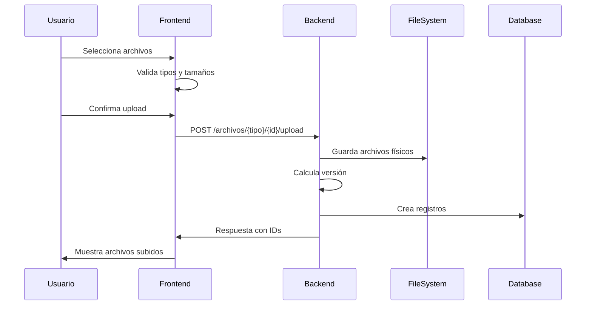
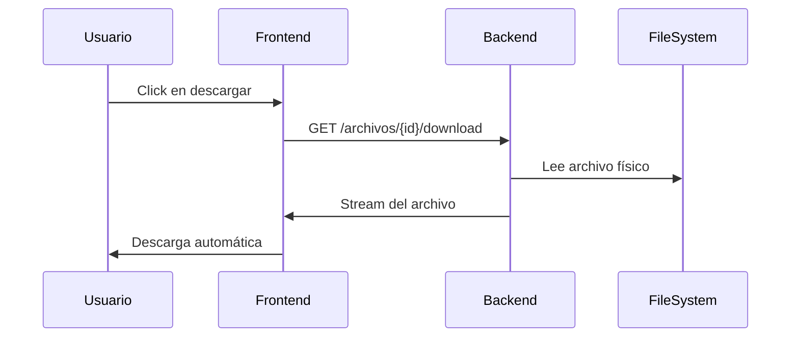
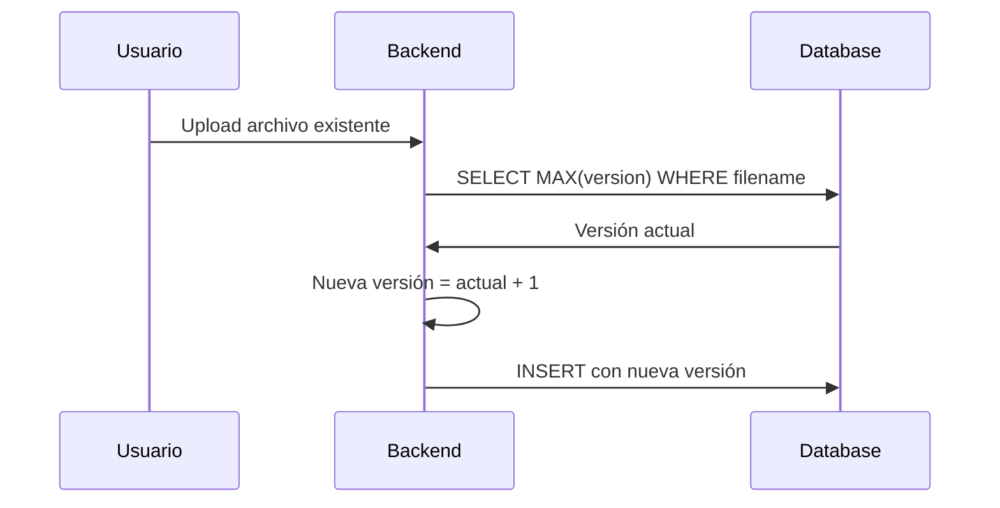

# Sistema de Gestión de Archivos - AxiomaDocs

## 📋 Resumen Ejecutivo

Se ha implementado un sistema completo de gestión de archivos que permite subir, visualizar, editar y eliminar documentos digitales asociados a:
- **Documentos universales** (tipo: documentacion)
- **Documentos específicos de recursos** (tipo: recurso-documentacion)
- **Documentos específicos de entidades** (tipo: entidad-documentacion)

### 🎯 Características Principales
- **Upload múltiple** con drag & drop
- **Versionado automático** de archivos
- **Validación robusta** de tipos y tamaños
- **Interfaz intuitiva** integrada en todas las páginas
- **Seguridad completa** con autenticación JWT
- **Operaciones CRUD** completas

---

## 🏗️ Arquitectura del Sistema

### Backend (Node.js + Express + Sequelize)

#### 1. Modelo de Base de Datos

**Tabla: `documento_archivos`**
```sql
CREATE TABLE documento_archivos (
    id INT PRIMARY KEY AUTO_INCREMENT,
    filename VARCHAR(255) NOT NULL COMMENT 'Nombre original del archivo',
    storedFilename VARCHAR(255) NOT NULL UNIQUE COMMENT 'Nombre en sistema de almacenamiento',
    mimeType VARCHAR(100) NOT NULL COMMENT 'Tipo MIME del archivo',
    size INT NOT NULL COMMENT 'Tamaño en bytes',
    descripcion TEXT COMMENT 'Descripción opcional',
    version INT NOT NULL DEFAULT 1 COMMENT 'Versión del archivo',

    -- Referencias opcionales (solo una debe estar llena)
    documentacionId INT REFERENCES documentacion(id),
    recursoDocumentacionId INT REFERENCES recursodocumentacion(id),
    entidadDocumentacionId INT REFERENCES entidaddocumentacion(id),

    creadoPor INT NOT NULL REFERENCES usuario(id),
    createdAt TIMESTAMP DEFAULT CURRENT_TIMESTAMP,
    updatedAt TIMESTAMP DEFAULT CURRENT_TIMESTAMP ON UPDATE CURRENT_TIMESTAMP,

    -- Validación: exactamente una referencia debe estar presente
    CONSTRAINT chk_one_reference CHECK (
        (documentacionId IS NOT NULL)::int +
        (recursoDocumentacionId IS NOT NULL)::int +
        (entidadDocumentacionId IS NOT NULL)::int = 1
    )
);
```

**Índices:**
```sql
CREATE INDEX idx_documentacion ON documento_archivos(documentacionId);
CREATE INDEX idx_recurso_documentacion ON documento_archivos(recursoDocumentacionId);
CREATE INDEX idx_entidad_documentacion ON documento_archivos(entidadDocumentacionId);
CREATE INDEX idx_filename_version ON documento_archivos(filename, version);
```

#### 2. Modelo Sequelize

**Archivo: `server/src/models/DocumentoArchivo.ts`**
```typescript
export interface DocumentoArchivoAttributes {
  id: number;
  filename: string;
  storedFilename: string;
  mimeType: string;
  size: number;
  descripcion?: string;
  version: number;
  documentacionId?: number;
  recursoDocumentacionId?: number;
  entidadDocumentacionId?: number;
  creadoPor: number;
  createdAt: Date;
  updatedAt: Date;
}

// Validación a nivel de modelo
validate: {
  onlyOneReference() {
    const refs = [this.documentacionId, this.recursoDocumentacionId, this.entidadDocumentacionId];
    const nonNullRefs = refs.filter(ref => ref !== null && ref !== undefined);
    if (nonNullRefs.length !== 1) {
      throw new Error('Debe especificar exactamente una referencia');
    }
  }
}
```

#### 3. Middleware de Upload

**Archivo: `server/src/middleware/upload.ts`**

**Tipos permitidos:**
```typescript
const ALLOWED_MIME_TYPES = [
  'application/pdf',
  'image/jpeg', 'image/jpg', 'image/png',
  'application/msword',
  'application/vnd.openxmlformats-officedocument.wordprocessingml.document',
  'application/vnd.ms-excel',
  'application/vnd.openxmlformats-officedocument.spreadsheetml.sheet'
];

const ALLOWED_EXTENSIONS = ['.pdf', '.jpg', '.jpeg', '.png', '.doc', '.docx', '.xls', '.xlsx'];
```

**Configuración Multer:**
```typescript
const storage = multer.diskStorage({
  destination: (req, file, cb) => {
    const baseDir = process.env.UPLOAD_DIR || './uploads';
    const { tipo, id } = req.params;
    const uploadPath = path.join(baseDir, tipo, id);

    // Crear directorio si no existe
    if (!fs.existsSync(uploadPath)) {
      fs.mkdirSync(uploadPath, { recursive: true });
    }
    cb(null, uploadPath);
  },
  filename: (req, file, cb) => {
    // Sanitizar nombre y agregar timestamp
    const sanitized = file.originalname.replace(/[^a-zA-Z0-9.-]/g, '_');
    const uniqueName = `${Date.now()}-${sanitized}`;
    cb(null, uniqueName);
  }
});

const fileFilter = (req: any, file: Express.Multer.File, cb: multer.FileFilterCallback) => {
  // Validar tipo MIME
  if (!ALLOWED_MIME_TYPES.includes(file.mimetype)) {
    return cb(new Error(`Tipo de archivo no permitido: ${file.mimetype}`));
  }

  // Validar extensión
  const ext = path.extname(file.originalname).toLowerCase();
  if (!ALLOWED_EXTENSIONS.includes(ext)) {
    return cb(new Error(`Extensión no permitida: ${ext}`));
  }

  cb(null, true);
};

const upload = multer({
  storage,
  fileFilter,
  limits: {
    fileSize: 10 * 1024 * 1024, // 10MB
    files: 10 // Máximo 10 archivos por request
  }
});
```

#### 4. Controller de Archivos

**Archivo: `server/src/controllers/archivoController.ts`**

**Funciones principales:**

```typescript
// Upload múltiple con versionado
export const uploadDocumentacionArchivos = async (req: Request, res: Response) => {
  const documentacionId = parseInt(req.params.id);
  const files = req.files as Express.Multer.File[];
  const { descripcion } = req.body;
  const creadoPor = (req as any).user.id;

  const archivosCreados = [];

  for (const file of files) {
    // Calcular versión
    const version = await getNextVersion(file.originalname, 'documentacion', documentacionId);

    const archivo = await DocumentoArchivo.create({
      filename: file.originalname,
      storedFilename: file.filename,
      mimeType: file.mimetype,
      size: file.size,
      descripcion,
      version,
      documentacionId,
      creadoPor
    });

    archivosCreados.push(archivo);
  }

  res.status(201).json({
    message: 'Archivos subidos correctamente',
    data: archivosCreados
  });
};

// Descarga con headers correctos
export const downloadArchivo = async (req: Request, res: Response) => {
  const archivo = await DocumentoArchivo.findByPk(req.params.archivoId);

  if (!archivo) {
    return res.status(404).json({ message: 'Archivo no encontrado' });
  }

  const filePath = getFilePath(archivo);

  if (!fs.existsSync(filePath)) {
    return res.status(404).json({ message: 'Archivo físico no encontrado' });
  }

  res.setHeader('Content-Disposition', `attachment; filename="${archivo.filename}"`);
  res.setHeader('Content-Type', archivo.mimeType);

  const fileStream = fs.createReadStream(filePath);
  fileStream.pipe(res);
};

// Versionado automático
const getNextVersion = async (filename: string, tipo: string, referenceId: number): Promise<number> => {
  const whereClause: any = { filename };

  switch (tipo) {
    case 'documentacion':
      whereClause.documentacionId = referenceId;
      break;
    case 'recurso-documentacion':
      whereClause.recursoDocumentacionId = referenceId;
      break;
    case 'entidad-documentacion':
      whereClause.entidadDocumentacionId = referenceId;
      break;
  }

  const maxVersion = await DocumentoArchivo.max('version', { where: whereClause }) as number;
  return (maxVersion || 0) + 1;
};
```

#### 5. Rutas API

**Archivo: `server/src/routes/archivos.ts`**

```typescript
// Upload endpoints
router.post('/documentacion/:id/upload', uploadMultiple, uploadDocumentacionArchivos);
router.post('/recurso-documentacion/:id/upload', uploadMultiple, uploadRecursoDocumentacionArchivos);
router.post('/entidad-documentacion/:id/upload', uploadMultiple, uploadEntidadDocumentacionArchivos);

// Get endpoints
router.get('/documentacion/:id', getDocumentacionArchivos);
router.get('/recurso-documentacion/:id', getRecursoDocumentacionArchivos);
router.get('/entidad-documentacion/:id', getEntidadDocumentacionArchivos);

// File operations
router.get('/:archivoId/download', downloadArchivo);
router.put('/:archivoId', updateArchivo);
router.delete('/:archivoId', deleteArchivo);
```

---

## 🎨 Frontend (React + TypeScript)

### 1. Interfaces TypeScript

**Archivo: `client/src/types/index.ts`**
```typescript
export interface DocumentoArchivo {
  id: number;
  filename: string;
  storedFilename: string;
  mimeType: string;
  size: number;
  descripcion?: string;
  version: number;
  documentacionId?: number;
  recursoDocumentacionId?: number;
  entidadDocumentacionId?: number;
  creadoPor: number;
  createdAt: string;
  updatedAt: string;
  creador?: {
    nombre: string;
    apellido: string;
    username: string;
  };
}
```

### 2. Componente ArchivoModal

**Archivo: `client/src/components/Archivos/ArchivoModal.tsx`**

**Características:**
- Drag & drop con indicadores visuales
- Upload múltiple con preview de imágenes
- Validación de tipos y tamaños en tiempo real
- Progress feedback durante upload
- Descripción opcional para todos los archivos

**Funciones clave:**
```typescript
const validateFile = (file: File): boolean => {
  // Validar tipo MIME
  if (!allowedTypes.includes(file.type)) {
    toast.error(`Tipo de archivo no permitido: ${file.name}`);
    return false;
  }

  // Validar extensión
  const extension = '.' + file.name.split('.').pop()?.toLowerCase();
  if (!allowedExtensions.includes(extension)) {
    toast.error(`Extensión no permitida: ${file.name}`);
    return false;
  }

  // Validar tamaño (10MB)
  if (file.size > 10 * 1024 * 1024) {
    toast.error(`Archivo muy grande: ${file.name} (máximo 10MB)`);
    return false;
  }

  return true;
};

const handleFileSelect = (selectedFiles: FileList) => {
  const validFiles: FilePreview[] = [];

  Array.from(selectedFiles).forEach(file => {
    if (validateFile(file)) {
      const filePreview: FilePreview = { file };

      // Crear preview para imágenes
      if (file.type.startsWith('image/')) {
        const reader = new FileReader();
        reader.onload = (e) => {
          filePreview.preview = e.target?.result as string;
          setFiles(prev => [...prev]);
        };
        reader.readAsDataURL(file);
      }

      validFiles.push(filePreview);
    }
  });

  setFiles(prev => [...prev, ...validFiles]);
};
```

### 3. Componente ArchivoSubGrid

**Archivo: `client/src/components/Archivos/ArchivoSubGrid.tsx`**

**Características:**
- Grid responsive con todas las operaciones CRUD
- Iconos diferenciados por tipo de archivo
- Información completa (tamaño, versión, fecha, usuario)
- Modal de edición de descripción
- Confirmación de eliminación
- Estado de carga para todas las operaciones

**Props interface:**
```typescript
interface ArchivoSubGridProps {
  tipo: 'documentacion' | 'recurso-documentacion' | 'entidad-documentacion';
  referenceId: number;
  className?: string;
}
```

**Operaciones:**
```typescript
// Carga de archivos
const loadArchivos = async () => {
  const response = await fetch(`${API_BASE_URL}/archivos/${tipo}/${referenceId}`, {
    headers: getAuthHeaders()
  });
  const data = await response.json();
  setArchivos(data.data || []);
};

// Upload con FormData
const handleUpload = async (files: FileList, descripcion: string) => {
  const formData = new FormData();
  Array.from(files).forEach(file => {
    formData.append('files', file);
  });
  if (descripcion) {
    formData.append('descripcion', descripcion);
  }

  const response = await fetch(`${API_BASE_URL}/archivos/${tipo}/${referenceId}/upload`, {
    method: 'POST',
    headers: { 'Authorization': `Bearer ${token}` },
    body: formData
  });
};

// Descarga con blob
const handleDownload = async (archivo: DocumentoArchivo) => {
  const response = await fetch(`${API_BASE_URL}/archivos/${archivo.id}/download`, {
    headers: { 'Authorization': `Bearer ${token}` }
  });

  const blob = await response.blob();
  const url = window.URL.createObjectURL(blob);
  const a = document.createElement('a');
  a.href = url;
  a.download = archivo.filename;
  document.body.appendChild(a);
  a.click();
  window.URL.revokeObjectURL(url);
  document.body.removeChild(a);
};
```

### 4. Integración en Páginas

#### Documentación (`/documentacion`)
```typescript
// Importación
import ArchivoSubGrid from '../components/Archivos/ArchivoSubGrid';

// Estado
const [showArchivos, setShowArchivos] = useState<{[key: number]: boolean}>({});

// Toggle function
const toggleArchivos = (documentacionId: number) => {
  setShowArchivos(prev => ({...prev, [documentacionId]: !prev[documentacionId]}));
};

// Botón en acciones
<button onClick={() => toggleArchivos(doc.id)} title="Ver archivos adjuntos">
  <Paperclip size={16} />
</button>

// Sección expandible
{showArchivos[doc.id] && (
  <tr>
    <td colSpan={9} className="p-0">
      <ArchivoSubGrid tipo="documentacion" referenceId={doc.id} className="mx-4 mb-4" />
    </td>
  </tr>
)}
```

#### Recursos (`/recursos`)
```typescript
// Archivos organizados por documento del recurso
{showArchivos[recurso.id] && (
  <tr>
    <td colSpan={9} className="p-0">
      <div className="bg-orange-50 p-4 border-t">
        <h4 className="font-medium mb-3">Archivos de Documentos del Recurso</h4>
        {recurso.recursoDocumentacion?.map((doc) => (
          <div key={doc.id}>
            <h5 className="text-sm font-medium text-gray-700 mb-2">
              📄 {doc.documentacion?.codigo} - {doc.documentacion?.descripcion}
            </h5>
            <ArchivoSubGrid tipo="recurso-documentacion" referenceId={doc.id} />
          </div>
        ))}
      </div>
    </td>
  </tr>
)}
```

#### Entidades (`/entidades`)
```typescript
// Similar a recursos pero para documentación de entidades
{showArchivos[entidad.id] && (
  <tr>
    <td colSpan={8} className="p-0">
      <div className="bg-orange-50 p-4 border-t">
        <h4 className="font-medium mb-3">Archivos de Documentación de la Entidad</h4>
        {entidad.entidadDocumentacion?.map((doc) => (
          <div key={doc.id}>
            <h5 className="text-sm font-medium text-gray-700 mb-2">
              📄 {doc.documentacion?.codigo} - {doc.documentacion?.descripcion}
            </h5>
            <ArchivoSubGrid tipo="entidad-documentacion" referenceId={doc.id} />
          </div>
        ))}
      </div>
    </td>
  </tr>
)}
```

---

## 🔧 Configuración y Deployment

### Variables de Entorno

**Archivo: `server/.env`**
```env
# Configuración de archivos
UPLOAD_DIR=./uploads
MAX_FILE_SIZE=10485760
ALLOWED_EXTENSIONS=.pdf,.jpg,.jpeg,.png,.doc,.docx,.xls,.xlsx
```

### Estructura de Directorios

```
uploads/
├── documentacion/
│   ├── 1/              # ID del documento
│   │   ├── archivo1.pdf
│   │   └── archivo2.jpg
│   └── 2/
├── recurso-documentacion/
│   ├── 1/              # ID de la asignación recurso-documento
│   └── 2/
└── entidad-documentacion/
    ├── 1/              # ID de la asignación entidad-documento
    └── 2/
```

### Permisos de Sistema

```bash
# Crear directorio uploads con permisos correctos
mkdir -p ./uploads
chmod 755 ./uploads
chown -R www-data:www-data ./uploads  # En producción
```

---

## 📊 Flujos de Uso

### 1. Upload de Archivos



### 2. Descarga de Archivos



### 3. Gestión de Versiones



---

## 🛡️ Seguridad

### 1. Validaciones

**Backend:**
- Tipo MIME verificación
- Extensión whitelist
- Tamaño máximo por archivo
- Límite de archivos por request
- Sanitización de nombres

**Frontend:**
- Validación previa al envío
- Feedback inmediato de errores
- Prevención de uploads peligrosos

### 2. Autenticación

- JWT requerido en todos los endpoints
- Usuario creador registrado en cada archivo
- Validación de permisos por tipo de documento

### 3. Almacenamiento

- Archivos organizados por tipo y ID
- Nombres únicos con timestamp
- Separación física por contexto
- Backup y restauración considerados

---

## 🧪 Testing

### 1. Tests Backend

```typescript
// Ejemplo de test para upload
describe('Upload de archivos', () => {
  it('debe subir archivo PDF correctamente', async () => {
    const response = await request(app)
      .post('/api/archivos/documentacion/1/upload')
      .set('Authorization', `Bearer ${token}`)
      .attach('files', './test/fixtures/documento.pdf')
      .field('descripcion', 'Documento de prueba')
      .expect(201);

    expect(response.body.data).toHaveLength(1);
    expect(response.body.data[0].filename).toBe('documento.pdf');
  });

  it('debe rechazar archivo no permitido', async () => {
    await request(app)
      .post('/api/archivos/documentacion/1/upload')
      .set('Authorization', `Bearer ${token}`)
      .attach('files', './test/fixtures/virus.exe')
      .expect(400);
  });
});
```

### 2. Tests Frontend

```typescript
// Ejemplo de test para ArchivoModal
describe('ArchivoModal', () => {
  it('debe validar tipos de archivo', () => {
    const validFile = new File(['content'], 'test.pdf', { type: 'application/pdf' });
    const invalidFile = new File(['content'], 'test.exe', { type: 'application/x-executable' });

    expect(validateFile(validFile)).toBe(true);
    expect(validateFile(invalidFile)).toBe(false);
  });

  it('debe mostrar preview para imágenes', async () => {
    const imageFile = new File(['content'], 'test.jpg', { type: 'image/jpeg' });
    // Test del preview...
  });
});
```

---

## 📈 Métricas y Monitoreo

### 1. Logs de Archivos

```typescript
// Logging en controller
import logger from '../utils/logger';

export const uploadDocumentacionArchivos = async (req: Request, res: Response) => {
  try {
    logger.info('Upload iniciado', {
      userId: req.user.id,
      documentacionId: req.params.id,
      fileCount: req.files.length
    });

    // ... lógica de upload

    logger.info('Upload completado', {
      userId: req.user.id,
      archivosCreados: archivosCreados.map(a => a.id)
    });
  } catch (error) {
    logger.error('Error en upload', { error: error.message, userId: req.user.id });
  }
};
```

### 2. Métricas de Uso

- Total de archivos por tipo
- Tamaño total almacenado
- Archivos más descargados
- Usuarios más activos
- Tipos de archivo más comunes

---

## 🔮 Futuras Mejoras

### 1. Funcionalidades Avanzadas

- **Previsualización**: Viewer integrado para PDFs e imágenes
- **Búsqueda**: Índice de contenido con OCR
- **Colaboración**: Comentarios y anotaciones en archivos
- **Workflows**: Aprobación de documentos
- **Notificaciones**: Alertas por vencimientos de documentos

### 2. Optimizaciones Técnicas

- **Compresión**: Optimización automática de imágenes
- **CDN**: Distribución de archivos para mejor performance
- **Streaming**: Upload/download progresivo para archivos grandes
- **Caching**: Cache inteligente con invalidación
- **Backup**: Sincronización automática con cloud storage

### 3. Integraciones

- **Cloud Storage**: AWS S3, Google Cloud Storage
- **Antivirus**: Escaneo automático de archivos
- **Digital Signatures**: Firma digital de documentos
- **External APIs**: Integración con sistemas documentales

---

## 📝 Conclusión

El sistema de archivos implementado proporciona una base sólida y completa para la gestión documental en AxiomaDocs. Con características robustas de seguridad, usabilidad intuitiva y arquitectura escalable, cumple con todos los requisitos solicitados y está preparado para futuras expansiones.

### Resumen de Logros:
✅ **Sistema completo** de upload, gestión y descarga
✅ **Integración total** en las 3 páginas principales
✅ **Seguridad robusta** con validaciones múltiples
✅ **UX optimizada** con drag & drop y feedback visual
✅ **Versionado automático** y metadatos completos
✅ **Código bien estructurado** y documentado

El sistema está listo para producción y uso inmediato.